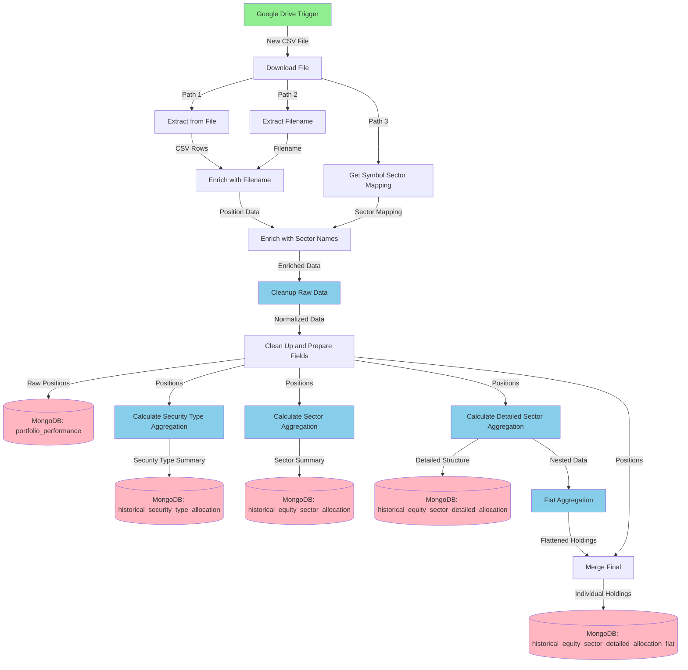

# Upload Position File Workflow

## Overview

This n8n workflow automatically processes portfolio position files exported from Charles Schwab. It monitors a Google Drive folder for new CSV files, extracts and cleans the position data, enriches it with sector information, performs multiple aggregation analyses, and stores the results in MongoDB.

## Workflow Diagram



## Workflow Components

### Trigger

**Google Drive Trigger**
- **Purpose**: Monitors a specific Google Drive folder (`charles_schwab`) for new file creation events
- **Polling Interval**: Every minute
- **Authentication**: Service account (n8n-test-workflow)
- **Trigger Condition**: When a CSV file is created in the watched folder

### Data Extraction and Enrichment

#### 1. Download File
- Downloads the CSV file from Google Drive using the file ID
- Outputs binary file content with original filename
- Splits flow into 3 parallel paths for processing

#### 2. Extract from File
- Parses CSV content starting from line 3 (skips header rows)
- Converts CSV into structured position records
- Outputs array of position data

#### 3. Extract Filename (Python)
- Custom Python function: `extract_filename()`
- Extracts the original filename from file metadata
- Used for tracking data source and snapshot identification

#### 4. Get Symbol Sector Mapping
- MongoDB query on `ticker_sector_mapping` collection
- Retrieves sector information for stock symbols
- Returns only `symbol` and `sector` fields

#### 5. Enrich Raw Data with Filename
- Merge node (combine mode)
- Combines position rows with filename metadata

#### 6. Enrich Raw Data with Sector Names
- Merge node (advanced merge)
- Joins position data with sector information
- Matches on `symbol` field

### Data Normalization

#### 7. Cleanup Raw Data for Storage (Python)
Custom Python module that normalizes CSV data with the following functions:

- `normalize_schwab_row()`: Converts CSV rows to structured documents
- `_parse_snapshot_metadata()`: Extracts date/time from filename
- `_extract_asset_identifiers()`: Extracts symbol, description, security type, sector
- `_build_asset_document()`: Creates asset information record
- `_build_position_document()`: Creates position metrics record

**Output Structure**:
```json
{
  "doc_id": "account|asset_key|filename",
  "account_id": "schwab-1",
  "asset_key": "EQUITY:SYMBOL:XXX",
  "snapshot_date": "2025-12-14",
  "snapshot_at": "ISO timestamp",
  "asset": {
    "symbol": "string",
    "name": "string",
    "security_type": "string",
    "sector": "string",
    "rating": "string",
    "updated_at": "timestamp"
  },
  "position": {
    "quantity": "float",
    "price": "float",
    "market_value": "float",
    "cost_basis": "float",
    "gains": "object",
    "changes": "object",
    "market_data": "object"
  }
}
```

#### 8. Clean Up and Prepare Fields
- Field mapping node (27 custom field mappings)
- Extracts and renames fields from normalized data
- Flattens nested structure for easier querying

**Key Fields**:
- Account and security identifiers: `account_id`, `asset_key`, `symbol`
- Position metrics: `quantity`, `price`, `market_value`, `cost_basis`
- Gain/loss data: `gain_abs`, `gain_pct`
- Change metrics: `day_change_abs`, `day_change_pct`, `price_change_abs`, `price_change_pct`
- Market data: `price_high_52w`, `price_low_52w`, `pe_ratio`
- Calculated fields: `price_low_52w_ratio`
- Metadata: `snapshot_date`, `snapshot_at`, `filename`, `sector`

### Storage and Aggregation

#### 9. Create or Update Raw Data
- MongoDB update node (upsert operation)
- **Collection**: `portfolio_performance`
- **Key**: `doc_id`
- Stores raw position records

#### 10. Calculate Security Type Aggregation (Python)
Aggregates positions by security type and snapshot date.

**Output Format**: Wide-format DataFrame with one row per snapshot
- `mv__[security_type]`: Market values by security type
- `alloc__[security_type]`: Allocation percentages by security type
- Includes `TOTAL` row with account total market value

#### 11. Create or Update Security Type Aggregation
- MongoDB update node (upsert)
- **Collection**: `historical_security_type_allocation`
- **Key**: `snapshot_at`

#### 12. Calculate Sector Aggregation (Python)
Aggregates equity positions by sector with wide-format output.

**Features**:
- Filters only equity assets (EQUITY: prefix)
- Groups by sector, calculates totals and allocations
- Pivots to wide format with `mv__` and `alloc__` columns
- Handles unknown sectors

#### 13. Update Sector Allocation Documents
- MongoDB update node (upsert)
- **Collection**: `historical_equity_sector_allocation`
- **Key**: `snapshot_at`

#### 14. Calculate Detailed Sector Aggregation (Python)
Creates nested structure with sector data and individual holdings.

**Output Structure**:
```json
{
  "snapshot_at": "timestamp",
  "mv__equity_total": "float",
  "mv__account_total": "float",
  "sectors": {
    "sector_slug": {
      "sector": "sector_name",
      "market_value": "float",
      "alloc_pct_of_equity": "float",
      "alloc_pct_of_account": "float",
      "holdings": [
        {
          "symbol": "XXX",
          "name": "Company Name",
          "market_value": "float",
          "alloc_of_equity": "float",
          "alloc_of_sector": "float",
          "alloc_of_account": "float"
        }
      ]
    }
  }
}
```

#### 15. Create or Update Security Aggregation Detail
- MongoDB update node (upsert)
- **Collection**: `historical_equity_sector_detailed_allocation`
- **Key**: `snapshot_at`

#### 16. Flat Aggregation (Python)
Flattens the nested sector/holdings structure into individual rows.

**Functionality**:
- Transforms nested sector→holdings structure into flat records
- Each holding becomes a separate row with all parent sector metadata
- Adds `doc_id` field for identification
- Output: One row per holding with full context

#### 17. Final Merge
- Combines flat holdings with sector aggregation data
- Merges data from multiple processing paths

#### 18. Save Flat Aggregation
- MongoDB update node (upsert)
- **Collection**: `historical_equity_sector_detailed_allocation_flat`
- **Key**: `doc_id`
- Stores individual holding records with full context

## MongoDB Collections

The workflow writes to five MongoDB collections:

| Collection | Purpose | Key Field |
|------------|---------|-----------|
| `portfolio_performance` | Raw position records with all asset and position details | `doc_id` |
| `historical_security_type_allocation` | Security type summaries (wide-format pivot) | `snapshot_at` |
| `historical_equity_sector_allocation` | Sector-level summaries (wide-format pivot) | `snapshot_at` |
| `historical_equity_sector_detailed_allocation` | Nested sector/holding structure | `snapshot_at` |
| `historical_equity_sector_detailed_allocation_flat` | Flattened holding records with sector context | `doc_id` |

## Key Features

- **Automated Trigger**: Runs whenever a new CSV file appears in the monitored Google Drive folder
- **Data Normalization**: Comprehensive cleanup of CSV data with multiple data types (strings, numbers, percentages, booleans)
- **Multi-level Aggregation**: Generates aggregations at security type, sector, and individual holding levels
- **Wide-format Pivoting**: Creates pivot tables with dynamically generated column names for each security type/sector
- **Nested Structure Support**: Maintains both nested and flattened versions of hierarchical data
- **Upsert Operations**: Uses MongoDB upsert to handle both new inserts and updates
- **Flexible Field Mapping**: Handles variations in CSV column naming from Charles Schwab exports
- **Account Tracking**: Maintains account identifiers and timestamps throughout the pipeline

## Data Flow Summary

1. **Trigger**: Google Drive detects new CSV file
2. **Download**: File is downloaded from Google Drive
3. **Extract**: CSV is parsed into structured rows
4. **Enrich**: Data is enriched with filename and sector information
5. **Normalize**: Raw data is cleaned and normalized with Python
6. **Store Raw**: Normalized positions saved to MongoDB
7. **Aggregate**: Multiple aggregation levels calculated in parallel:
   - Security type aggregation (wide-format)
   - Sector aggregation (wide-format)
   - Detailed sector aggregation (nested structure)
8. **Flatten**: Detailed aggregation flattened for easier querying
9. **Store All**: All aggregation levels saved to MongoDB

## Usage

1. Export position file from Charles Schwab
2. Upload CSV file to the monitored Google Drive folder
3. Workflow triggers automatically within 1 minute
4. All data is processed and stored in MongoDB
5. Query any of the five collections for analysis:
   - Use `portfolio_performance` for raw position details
   - Use `historical_security_type_allocation` for asset class allocation over time
   - Use `historical_equity_sector_allocation` for sector allocation trends
   - Use `historical_equity_sector_detailed_allocation` for hierarchical sector/holding analysis
   - Use `historical_equity_sector_detailed_allocation_flat` for flat holding-level queries

## Dependencies

- **n8n** workflow automation platform
- **Google Drive** for file monitoring and storage
- **MongoDB** for data persistence
- **Python** for data processing and aggregation
- **ticker_sector_mapping** MongoDB collection (must be pre-populated)
